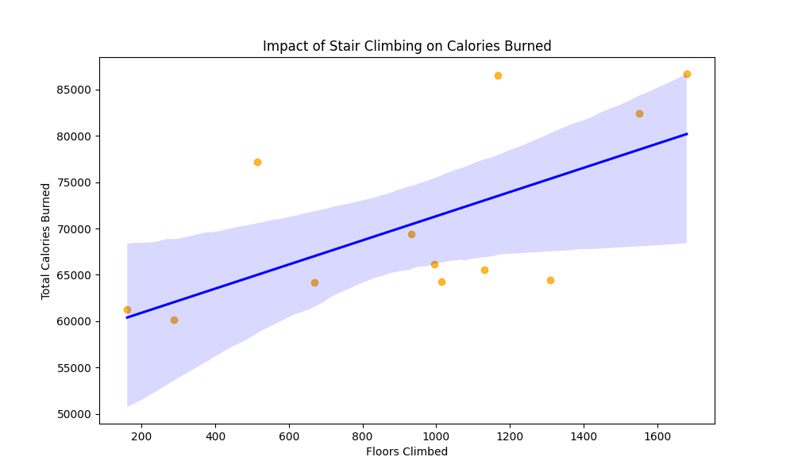

# Garmin Fitness Data Analysis

### SUMMARY
**Purpose:** This is a personal data-driven case study that analyzes my Garmin fitness data to uncover trends in activity, sleep, calorie burn, and stress. 
**Results:** Activity levels peak in the summer, with September being the most active month (highest intensity minutes, floors climbed, and calories burned) and March the least active. Step count peaked in May, likely due to the transition from winter to more outdoor hiking. Resting heart rate strongly correlates (0.73) with training intensity, but anaerobic activities like mountain biking cause sustained high heart rates despite lower recorded intensity minutes. September had the highest calorie burn, with stair climbing contributing significantly. Best sleep occurred in June, while August had the worst. However, there was no clear connection found between high activity and reduced sleep quality. Stress was highest in October but also peaks in January and February, while September was the least stressful month. Stress levels appear to follow a cyclical monthly pattern of rising and falling. **Conclusion:** The data suggests maintaining winter activity, balancing high-intensity workouts for recovery, and monitoring heart rate and stress levels for better long-term fitness and well-being.
**Acknowledgement:** This analysis was conducted with the help of ChatGPT, assisting in data processing, visualization, and interpretation to uncover meaningful trends from my Garmin data.

### QUESTIONS
**ACTIVITY**
- How do my total activity levels (steps, floors climbed, intensity minutes) change by month?
- What was my most active month? Least active?
- How consistent have I been with my workout frequency?
- Are there patterns in my resting heart rate and how they relate to training intensity?

**CALORIES**
- Which month do I burn the most calories?
- Is there a strong correlation between intensity minutes and calorie burn?
- Does increased activity lead to improved sleep quality, or does excessive exercise negatively impact sleep?
- Does stair climbing (floors climbed) contribute more to calorie burn than regular steps?

**SLEEP**
- How has my sleep duration and quality changed over time?
- Do my best sleep nights coincide with more or less physical activity?
- Is there a relationship between high-intensity activity and reduced sleep?

**STRESS**
- Which months or seasons show the highest and lowest stress levels?
- Does physical activity (steps, intensity minutes, floors climbed) correlate with lower stress levels?
- Do my highest stress weeks align with changes in physical activity, sleep, or heart rate?
- Is there a correlation between high-intensity training and higher/lower stress?

## DATA SOURCE

The data was obtained from my personal Garmin profile, collected through a Garmin smartwatch worn daily.
It was exported from Garmin Connect and contains various health and fitness metrics for analysis.
**Data Categories & Variables**
Activity: Steps taken, floors climbed, intensity minutes, total active time.
Calories: Total daily calories burned, resting vs. active calorie expenditure.
Heart Rate: Resting heart rate (RHR), heart rate trends over time.
Sleep: Total sleep duration, bedtime, wake time.
Stress: Daily stress level based on heart rate variability (HRV).
Time & Date: Data timestamps for analyzing trends by day, week, and month.
**Data Limitations**
- Sensor Accuracy: Garmin estimates for steps, calorie burn, sleep, and stress are not 100% precise.
- Data Gaps: Some days may have missing or incomplete data due to the watch not being worn, battery depletion, or syncing issues.
- Sleep Tracking Assumptions: Sleep stages are estimated based on movement and heart rate but may not match medical-grade sleep studies.
- Stress Measurement: Stress levels rely on HRV, which can be influenced by exercise, hydration, and other factors beyond mental stress.
- Calorie Burn Estimates: Garmin's calculations are based on heart rate and activity, but individual metabolic variations affect accuracy.
- External Factors: Activity levels, heart rate, and stress can be impacted by weather, lifestyle, and personal health, which are not captured in the dataset.

### Cleaning Process

Dates are standardized to "Month YYYY" across all datasets. 
Units were removed where needed (e.g., "bpm" in heart rate data). 
Aggregated properly (e.g., stress = monthly average, calories = monthly sum).
Time converted to minutes in sleep data.No empty or weird values (everything should be readable and structured).
Key Processing Functions
Standardizing Dates
def format_month_year(date_series, add_year=True):
    if add_year:
        date_series = date_series + " 2024"
    return pd.to_datetime(date_series, errors="coerce").dt.strftime("%B %Y")

Converting & Aggregating Data
def convert_to_numeric(df, columns):
    df[columns] = df[columns].apply(pd.to_numeric, errors="coerce")
    return df.groupby("date", as_index=False).sum()

Processing CSV Files Efficiently
def process_csv(filename, cleaning_function):
    file_path = os.path.join(DATA_FOLDER, filename)
    if os.path.exists(file_path):
        df = pd.read_csv(file_path, dtype=str)
        df = cleaning_function(df)
        df.to_csv(os.path.join(CLEANED_FOLDER, filename), index=False).

---

## 📊 RESULTS

### Activity Analysis: 

**How do my total activity levels (steps, floors climbed, intensity minutes) change by month?**
- Activity levels peak in the summer months (June–August) and gradually decline during the winter months (November–February).
- September is the most active month overall, with the highest levels of intensity minutes floors climbed, and calories burned.
- Activity trends suggest a strong seasonal influence, where you are likely engaging in more outdoor activities during warmer months.
  
**What was my most active month? Least active?**
- Most Active Month: September
- Least Active Month: March
  
**How consistent have I been with my workout frequency?**
- Activity levels remain relatively stable, with predictable seasonal fluctuations.
- I show a clear trend of increased activity in warm months and a slight decline in colder months—a pattern that aligns with general population behavior.
- Compared to the average American:
    - Fitness levels are well above the national average:
    - The CDC recommends at least 600 intensity minutes per month—I exceed this in every month except February and March.
    - The average American climbs only ~150 floors per month—my numbers are significantly higher, especially in the summer.
- Highest Step Count Month: May 2024
**Are there patterns in my resting heart rate and how they relate to training intensity?**
- Strong Positive Correlation (0.73) Between RHR & Training Intensity
- Normally, increased training lowers resting heart rate over time. We see RHR increases alongside training intensity, suggesting other influencing factors.

**Mountain biking as a major factor**
- Summer (May-September): I mountain bike frequently in spring and fall, which is a highly anaerobic activity.
- Mountain biking keeps heart rate elevated even at lower training intensity levels due to bursts of effort on climbs.
- This sustained high heart rate may inflate average RHR, explaining why it doesn’t drop as expected with increased training.
- Potential overtraining or inadequate recovery

**September 2024: Highest training intensity & highest max HR.**
- If recovery wasn’t sufficient, RHR may have remained elevated, mimicking overtraining effects.

**November as a recovery period**
- November 2024: Lowest resting heart rate & lowest max heart rate.
- I typically stop mountain biking in November, reducing high-intensity anaerobic stress.
- This period may allow your cardiovascular system to recover fully, explaining the drop in both max HR and RHR.

**Max HR peaks align with training intensity**
- Highest Max HR: September 2024 (most intense workouts).
- Lowest Max HR: November 2024 (least intense workouts).
- This confirms that your heart works hardest in peak training months.

### Monthly Activity Trends

### Monthly Step Count

### Resting Heart Rate vs. Training Intensity 

## Calorie Analysis:

**Which month do I burn the most calories?**
- Peak Calorie Burn Month: September 2024 
- September had the highest total calorie expenditure of any month.
- This aligns with the activity analysis 
     - Lowest Calorie Burn Month: February 2024 
- February had the lowest total calorie burn, corresponding with lower training intensity and fewer anaerobic workouts compared to summer months.

**Is there a strong correlation between intensity minutes and calorie burn?**
- Correlation Coefficient: ~0.89 (Very Strong)
- There is a very strong positive correlation (0.89) between training intensity (minutes) and total calories burned.
- This makes sense: the more intense your workouts, the more energy you burn.

**Does increased activity lead to improved sleep quality, or does excessive exercise negatively impact sleep?**
- Correlation Coefficient: ~0.037 (Very Weak Positive)
- Minimal correlation between training intensity and sleep duration
- This suggests activity levels don’t have a strong influence on how long you sleep.
Possible explanations:
- Recovery & fatigue factors might play a larger role.
- Overtraining effects (e.g., intense September workouts) could impact sleep quality negatively rather than extending sleep duration.
- Lifestyle factors (stress, bedtime consistency) may override activity-related sleep benefits.

**Does stair climbing (floors climbed) contribute more to calorie burn than regular steps?**
- Correlation Coefficient: ~0.74 (Strong)
- Stair climbing has a stronger correlation with calorie burn than steps alone.
- This suggests that floors climbed is a better predictor of calorie expenditure than just total steps.

### Monthly Calorie Burn

### Intensity Minutes vs Calories Burned

### Impact of Stair Climbing on Calories Burned

### Impact of Activity on Sleep Duration

## Sleep Analysis:

**How has my sleep duration changed over time?**
- My sleep duration fluctuates across months but does not show a clear seasonal trend.
- On average, I sleep ~507 minutes per night (~8 hours and 27 minutes).
- June had the longest average sleep duration (528 minutes per night 8 hours and 48 minutes).
- August had the shortest average sleep duration (492 minutes per night, 8 hours and 12 minutes).
- The worst sleep month (August) aligns with higher activity levels, which could suggest insufficient recovery after intense training.

**Do my best sleep nights coincide with more or less physical activity?**
Weak correlation (0.037) between training intensity and sleep duration—meaning more activity does not strongly predict better sleep.

**Is there a relationship between high-intensity activity and reduced sleep?**
- The very weak correlation (close to 0) suggests no strong relationship between high-intensity activity and reduced sleep duration.

### Monthly Sleep Duration

## Stress Levels vs. Sleep Duration

## Physical Activity vs Sleep Duration

## Stress Analysis:

**Which months or seasons show the highest and lowest stress levels?**
- Most Stressful Month: October 2024 (highest recorded average stress level). 
- Least Stressful Month: September 2024 (lowest recorded stress).
- Stress levels appear to follow a cyclical pattern, rising and falling at different points in the year rather than following a single increasing or decreasing trend.

**Does physical activity (steps, intensity minutes, floors climbed) correlate with lower stress levels?**
- Intensity Minutes vs. Stress had a weak negative correlation (-0.24) → More intense workouts slightly reduce stress, but not strongly.
- Steps vs. Stress had a moderate positive correlation (0.33) → More steps slightly increased stress levels.
- Floors Climbed vs. Stress had a weak negative correlation (-0.10) → Climbing stairs barely affects stress.

**Do my highest stress weeks align with changes in physical activity, sleep, or heart rate?**
- Stress vs. Intensity Minutes: -0.24 (weak negative correlation) Exercise may help reduce stress, but the effect is not very strong.
- Stress vs. Heart Rate: -0.43 (moderate negative correlation) Lower resting heart rate is linked to lower stress levels, suggesting better cardiovascular fitness may reduce stress.
- Activity vs. Heart Rate: 0.44 (moderate positive correlation)
- More intense training is associated with a higher resting heart rate.

**Is there a correlation between high-intensity training and higher/lower stress?**
- Correlation between Intensity Minutes & Stress: -0.24 (weak negative correlation) More intense physical activity is slightly linked to lower stress levels.
- Correlation between Resting Heart Rate & Stress: -0.43 (moderate negative correlation) Lower stress levels are more strongly associated with a lower resting heart rate.
- This suggests that better cardiovascular fitness may help reduce stress, rather than just the intensity of training.

### Stress Levels by Month

### Resting Heart Rate vs Stress

### Training Intensity vs Stress

---

## Conclusion:

This Garmin analysis revealed clear seasonal trends, strong fitness levels, and the relationship between intense training, recovery, and stress. The patterns uncovered here are not only useful for personal reflection but also demonstrate how wearable data can guide health decisions.

**Action Steps:**
- Use exercise as stress relief – Maintain consistent movement, even in lower-activity months.
- Experiment with relaxation strategies – Breathing exercises, stretching, or non-intense movement (walks, yoga, etc.) on high-stress days.
- Monitor for signs of burnout – If stress is high alongside training intensity, consider incorporating more recovery-focused days.
- Peak training months = higher heart rate, shorter sleep, and potential signs of overtraining. Balancing high-intensity workouts with proper recovery (sleep, stress management) could improve overall performance and well-being.
- Winter months = lower activity, better sleep, but higher stress. Aim to maintain at least 600 intensity minutes per month in the winter by incorporating more indoor workouts.

All analysis was done in Python using open-source tools and is fully reproducible.

---

